# OpenBCI Headphones
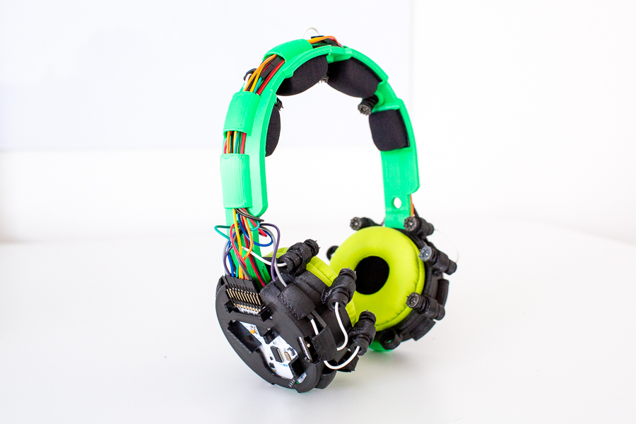

If we want our science and technology to grow faster, we need to get more people on it, right?

This repository contains the description and materials for turning the OpenBCI EXG biosignal acquisition system into 
a pair of functional headphones that can also record EEG, EOG, EMG, and ECG.

Please take a look at the sections below and the other repository files for assembly details.

------

# Resources
This project could not have been completed without the wonderful work by other open-source projects. 
Basically, this work is based heavily on these three projects:

1. <a href="https://docs.openbci.com/" target="_blank">OpenBCI</a> (Biosensing Components)
2. <a href="http://www.print.plus/" target="_blank">Print.Plus Headphones</a> (Headphones Design)
3. <a href="https://homebrewheadphones.com/" target="_blank">HomeBrew Headphones</a> (Audio Speakers)

All materials of those (and this project) are available under the Creative Commons Share-alike 4.0 International license.

------

# List of Materials

| Amount | Part   Description                                                  | Instance /   Reference                                                                                               |
|--------|---------------------------------------------------------------------|----------------------------------------------------------------------------------------------------------------------|
| 1      | OpenBCI Cyton Board + Ultracortex Electrodes   (Biosignal Acquisition Kit) | Available from the manufacturer at: https://shop.openbci.com/products/d-i-y-neurotechnologists-starter-kit?variant=13043169493064   |
| 1      | 3D-Printed Headphones Kit (incl. Headband, Speakers, and Electrodes)  | Custom [3D-Print Files](./stl/) available in this repository                                                        |
| 1      | Headband Cushion (kwmobile Sennheiser HD545 replacement)             | Available, e.g. at: https://www.amazon.de/gp/product/B08C57V9H9/ref=ppx_yo_dt_b_asin_title_o00_s00?ie=UTF8&psc=1             |
| 2      | Ear Cushions (70mm diameter)                                         | Available, e.g. at: https://www.amazon.de/gp/product/B089SS6WD5/ref=ppx_yo_dt_b_asin_title_o07_s01?ie=UTF8&psc=1             |
| 2      | Audio Drivers (Dayton Audio CE38MB-32 1-1/2"" Mini Speaker)          | Available, e.g. at: https://www.parts-express.com/Dayton-Audio-CE38MB-32-1-1-2-Mini-Speaker-Black-32-Ohm-285-131                               |
| 2      | Audio Jacks (2.5mm)                                                  | Available, e.g. at: https://www.amazon.de/gp/product/B009D5388O/ref=ox_sc_act_title_1?smid=A2X1ST6CC1USDW&psc=1                               |
| 2      | Hookup Wire (4x10cm long)                                            | Available, e.g. at: https://www.adafruit.com/product/288                               |
| 1      | Speaker Cable (Sol Republic Master Tracks HD V8 V10 V12 X3)          | Available, e.g. at: http://shorturl.at/szBKM                               |
| 10     | Jumper Connector Cables Female-Male (10cm, 20cm & 40cm)              | Available, e.g. at: https://www.adafruit.com/product/1953                                                      |
| 1      | Lithium Ion Polymer Battery - 3.7v 500mAh (JST-PH Connector)             | Available, e.g. at: https://www.adafruit.com/product/1578
| 1      | Lithium Ion Polymer Battery 500mm Extension Cable (JST-PH Connector)        | Available, e.g. at: https://www.adafruit.com/product/1131                                          

Lastly, in terms of **tools**, you will definitely need: 

- Soldering iron (to assemble the audio drivers)
- Small screwdriver (to assemble the electrodes)
- Pair of scissors (to cut the headband cushion)

------

# Assembly Instructions
To put the headphones together, you need to first make sure that you have all the required components ready. 
That means sourcing the components and, if you decide so, 3D-printing the headphone parts.
The picture below shows all components and required tools in one place.

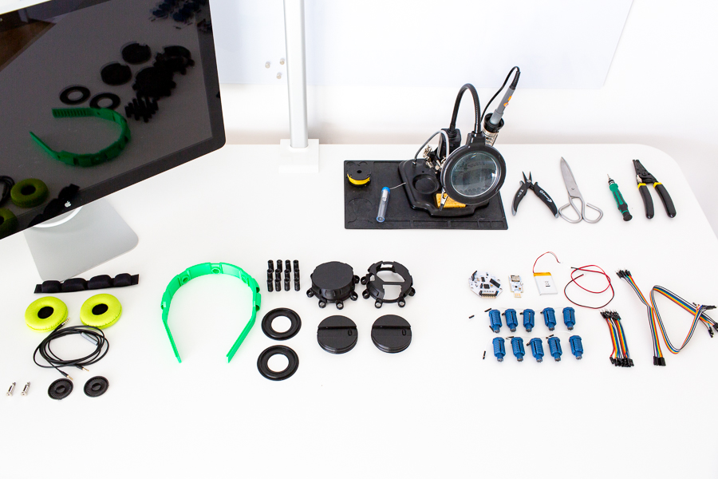
 
## 3D-Print the Parts
All of the 3D-printed parts can be manufactured using a regular desktop FDM printer with a 0.4mm brass nozzle and consumer-grade plastics (e.g. PLA).
Importantly, you don't have to set up any particular support structures. These are either not required or already modeled in.
However, some of the parts have particular requirements in terms of stiffness and strength. Therefore, we recommend selecting
appropriate materials for these parts. 

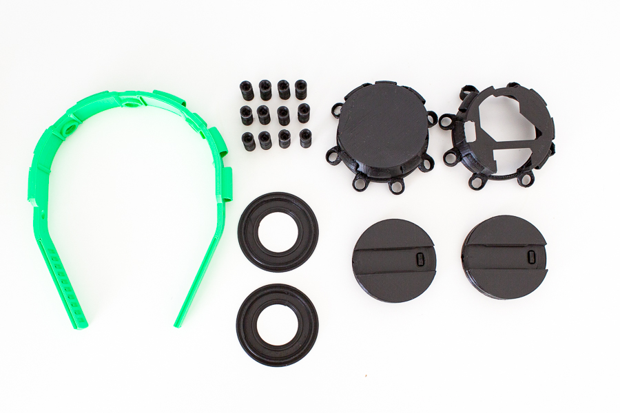 

### Headband
It is of particular importance for the headband to achieve a high level of flexibility (a low level of stiffness).  
As the headband must bend sufficiently, a more elastic material prevents the headband from breaking during regular use.
Believe us, it happened more times than we'd like to admit during testing... Nevertheless, that helped us figure out suitable materials.
To date, we used the <a href="https://www.extrudr.com/en/products/catalogue/pla-nx2-signalgrun_1980/" target="_blank">PLA NX2 from extrudr</a> 
as it provides the highest material flexibility that we found. The <a href="https://www.ultrafusefff.com/product/ultrafuse-pla-blue-1-75mm-750g/" target="_blank">Ultrafuse PLA from BASF</a>
also works fairly well, as does the <a href="https://fiberlogy.com/en/fiberlogy-filaments/filament-easy-pla/" target="_blank">EASY PLA from fiberlogy</a>. In contrast, the <a href="https://www.extrudr.com/en/products/catalogue/green-tec-pro-schwarz_2284/" target="_blank">GreenTEC Pro from extrudr</a>, 
which we recommend for parts that need to be robust was found to be much too stiff for good use with the headband.

Beyond the right material, it is only important to prevent warping during the print, as already low warping levels can cause the 
electrode holes to become distorted and unusable. Therefore, we recommend printing at lower temperatures and slow speeds to allow for sufficient material cooling. 
A layer height of 0.2mm is sufficient for this part. Also, you might want to try to print with low infill to retain the flexibility (5-10%).

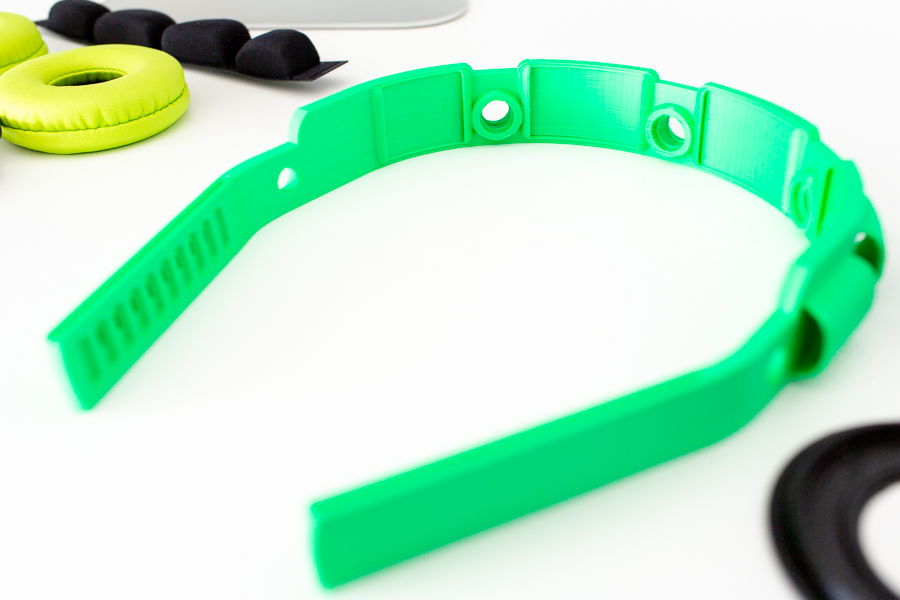

### Electrodes
As mentioned above, we recommend using a material with high stiffness like the <a href="https://www.extrudr.com/en/products/catalogue/green-tec-pro-schwarz_2284/" target="_blank">GreenTEC Pro from extrudr</a> to print the spring electrodes. 
This material also provides the advantage that it basically does not warp at all. With good retraction settings and 
slow print speeds, you can achieve robust and clean spring electrode prints. 
Also, we printed our electrodes with 0.1mm layer height to make the overhangs print cleaner.

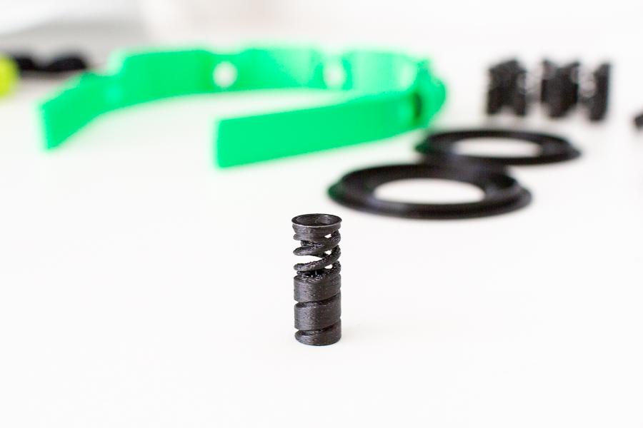
 
### Remaining Parts
The remaining parts don't have any particular requirements for printing. You can choose a material that you prefer and 
print them with a regular layer height of 0.2mm at moderate speeds (30-40 mm/s). 
In our screenshots, we used the <a href="https://www.extrudr.com/en/products/catalogue/green-tec-pro-schwarz_2284/" target="_blank">GreenTEC Pro</a> material again for these parts.
 
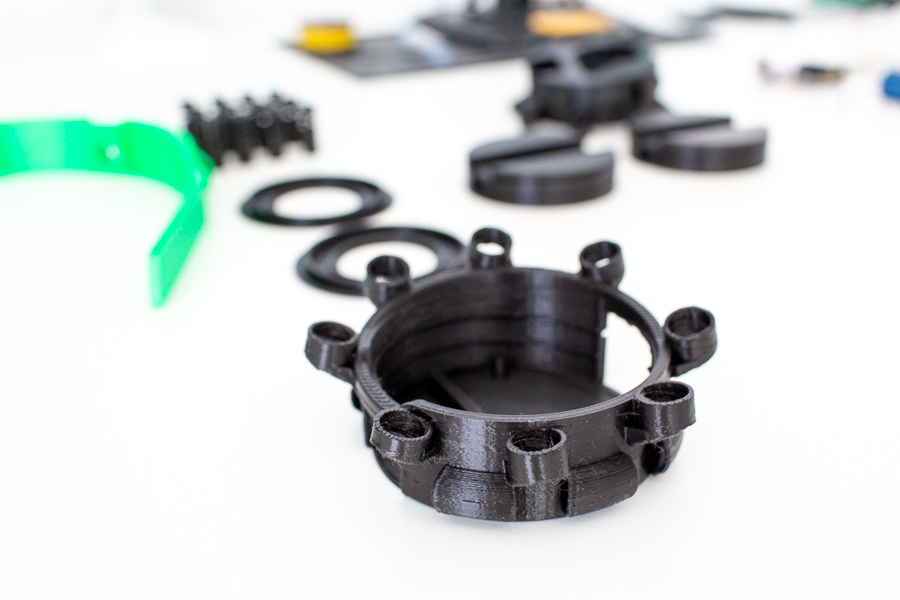

## Electrode Assembly
To finalize the spring electrodes, you need to convert the OpenBCI Ultracortex MK IV electrodes next.
This step is pretty straightforward. 
Use a small screwdriver to screw off the spike electrodes from their original bodies.

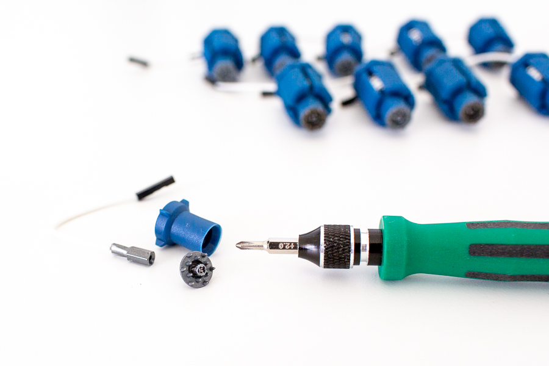
 
Afterwards, place first the terminal into the spring electrode. You might have to use your screwdriver to push them in.
Be careful, though, to not damage the cable as it can fairly easily become separated if you apply too much force at the end of the crimp terminal.
Once the terminal is inserted, place the spike electrode on the top, push the electrode together slightly and tighten the screw again. 
Do this a couple of times, and voilà - you have a nice set of 3D-printed headphone electrodes. 

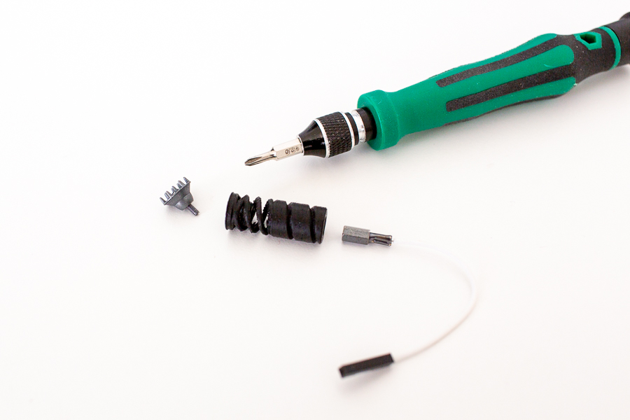

## Cushion Assembly
Next, you can ready the headband and speaker covers by attaching the cushions. 
Having these cushions is super important to achieve decent wearing comfort.
To complete this step, you will require only a pair of scissors.

The headband cushion piece can be cut off at the bridges between the pads.

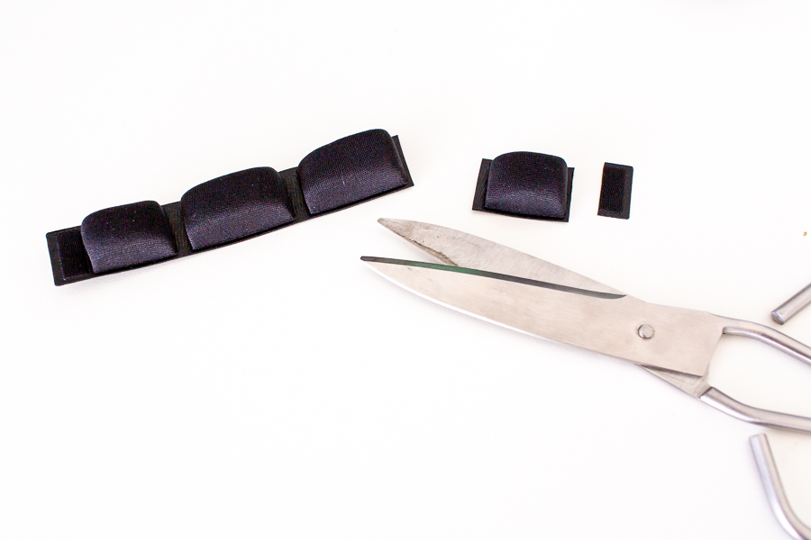 

Once you have done this, you can start inserting the individual pads into the headband. 
It might take a few tries to cut them to the correct size. 
Leave a slight overhang at each pad to make sure the pad is kept in place by some pressure. 

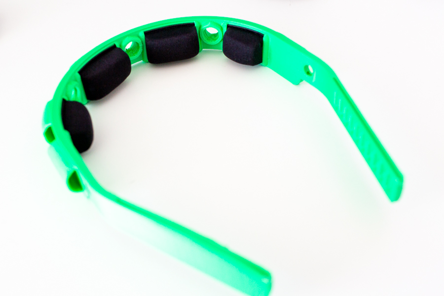

For the speaker cover, stretch the fabric a bit over the cover to attach the cushion.
Piece of cake. It can take some fabric wrestling, though, on the first try.

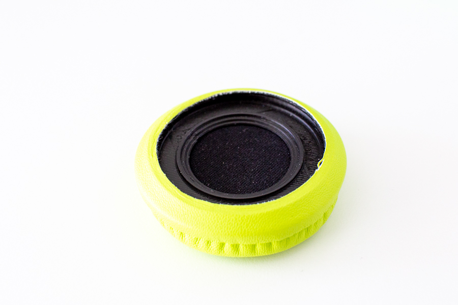

## Speaker Assembly
For the assembly of the speaker, we folloed the instructions of the <a href="https://homebrewheadphones.com/build/" target="_blank">HomeBrew Headphones</a> closely. 
You could follow that link and get the same (and extended) instructions. We just include them here again for completeness.

First, you need to solder the hookup wire to the 2.5mm jacks. 
Cut the hookup wire into four approx 2″ or 5cm lengths and strip the insulation from about 1/8″ or 3mm from the ends.
If you are using the recommended jacks, solder the negative (green) wire onto the large tab and the positive (yellow) onto the small round one.

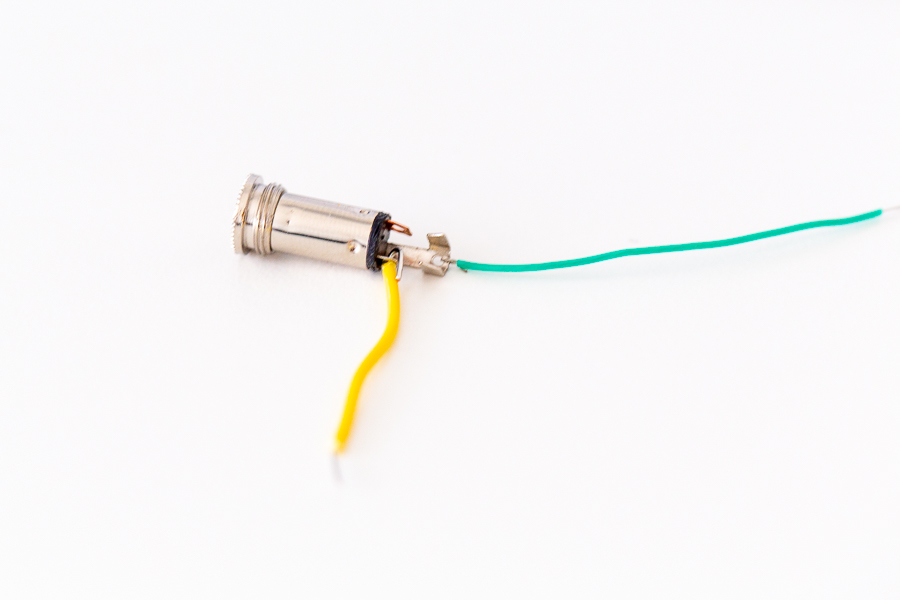

Next, you can place the audio jacks and drivers into the speaker housing (see picture below).
Be careful not to damage the fragile mylar film in the drivers.
Afterwards, you can solder the hookup wires to the audio drivers. 
The red terminal is positive, and the other is negative. 
You won’t need any solder for this – melt the solder tab on the driver with your soldering iron, then insert the wire into the puddle and remove the iron while still holding the wire until the solder solidifies. 
Be careful not to apply too much heat, as this may damage the driver.

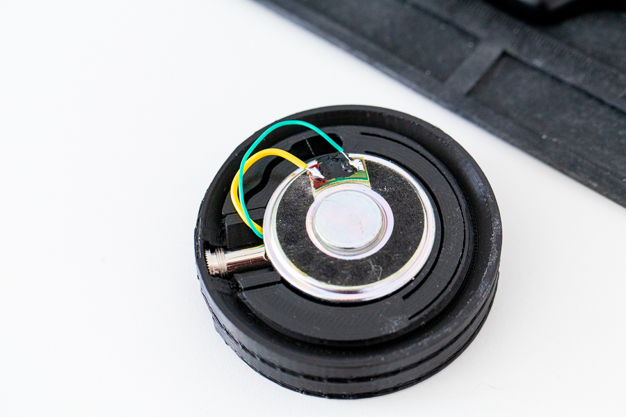

If you would like to tune the sound, please take a look at the <a href="https://homebrewheadphones.com/build/" target="_blank">HomeBrew Headphones build instructions</a> where a thorough documentation is provided for this step.

Finally, to complete the speaker assembly, place the speaker cover with the ear cushions on top and twist to lock them in place. Ta daaaa - you have got some real headphone speakers - assembled all by yourself!

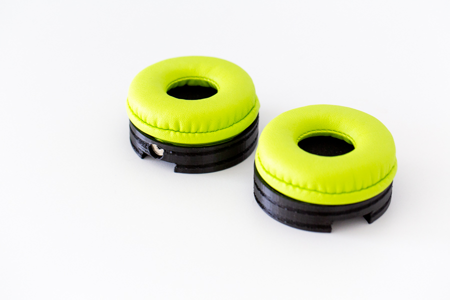

## Electronics Assembly
After all components are ready, you can now finally put the headset together. 
To do this, first, place the battery and Cyton board into the electronics enclosures.
For the Cyton board, attach the battery extension cable already.

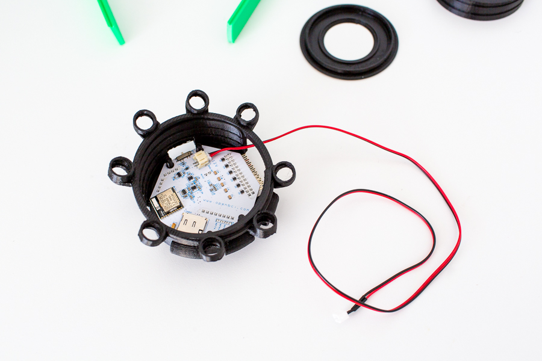
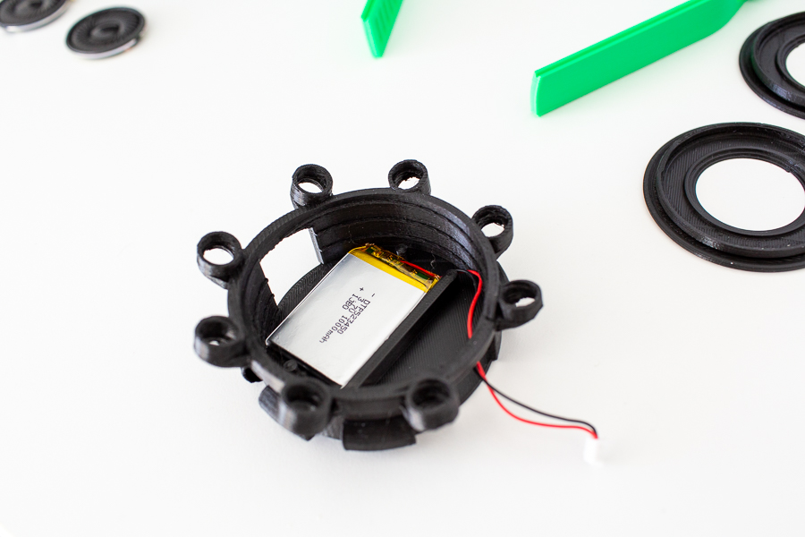 

Now, screw in the assembled speakers. Make sure that the battery cables are sticking out of the enclosure for this.

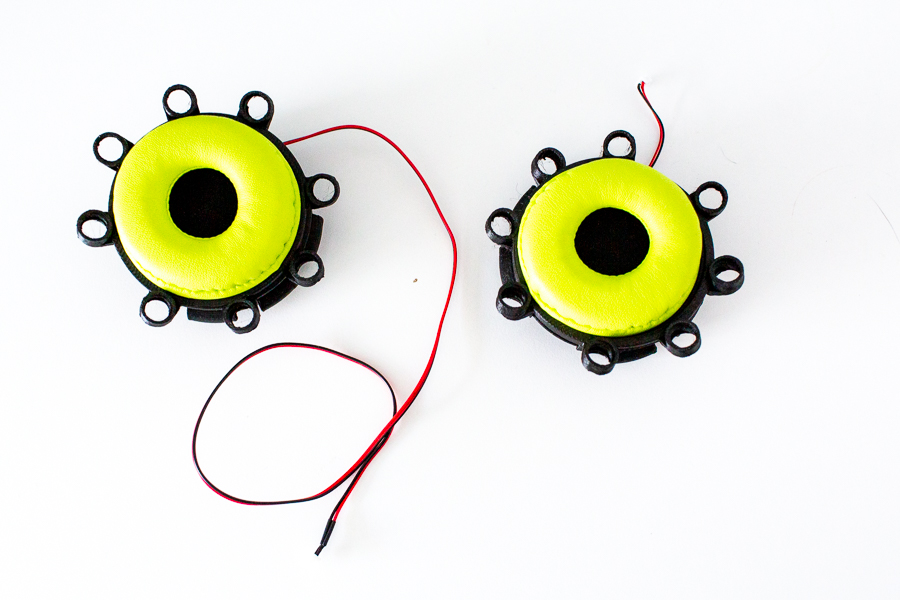 

Next, attach the headband to both the left and right speakers. After this, you can route the battery cable from 
the left to the right ear. Test if the Cyton board can be powered on before continuing.
  
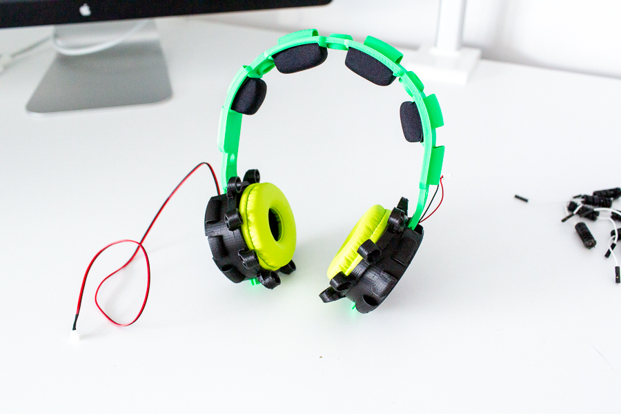

At this stage, things are starting to look like headphones, right? Now the only thing left to do is to attach the
electrodes. No electrodes - no electrophysiological sensing. The electrodes screw in the holders easily. Before you start
screwing around, you should take a second though, to consider which electrode positions you would like to use in your recordings.
As the Cyton board can only fit 8 channels (+ reference and ground electrode), your selection for the electrode positions
should be rooted in the phenomenon you are interested in measuring.

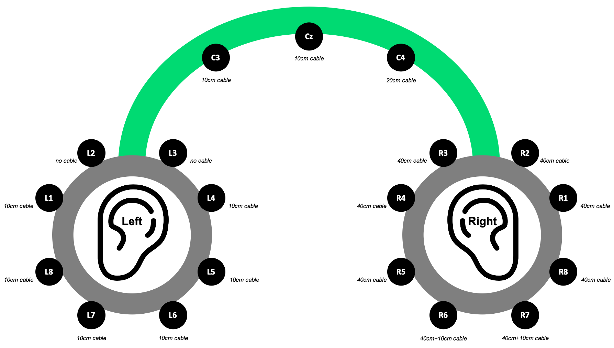

Once you have decided, screw the electrodes into their holders and attach the jumper wires. 
Route the wires through the cable ducts and onto the Cyton board (in the bottom row!).
We recommend using the same color scheme as in OpenBCI GUI for the different channels (see screenshot below).
This will help immensely later on if you have trouble achieving good contact at a specific electrode position.
For the Cyton board, the reference electrode needs to be attached to the first pin (SRB2 pin), the ground electrode 
needs to be attached to the penultimate pin (BIAS pin). For more details on how to set up the Cyton to record EEG, 
please take a look at the <a href="https://docs.openbci.com/GettingStarted/Boards/CytonGS/" target="_blank">excellent documentation from OpenBCI</a>.  

Well, that is really it. You are set up and ready to go! This is what your resulting headset should look like during this final setup step:

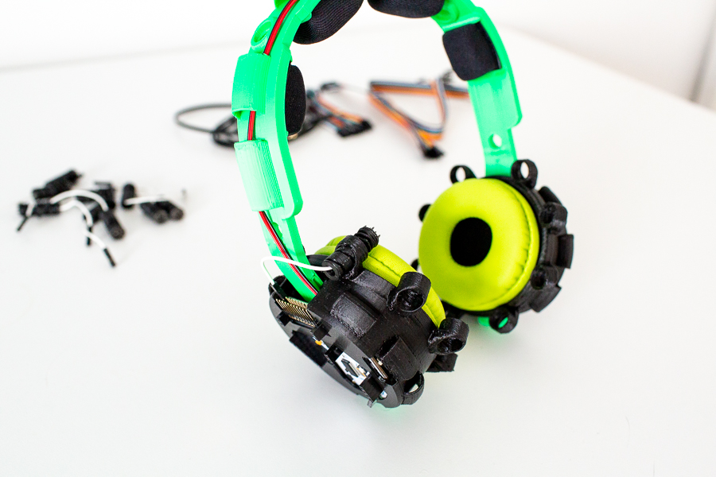
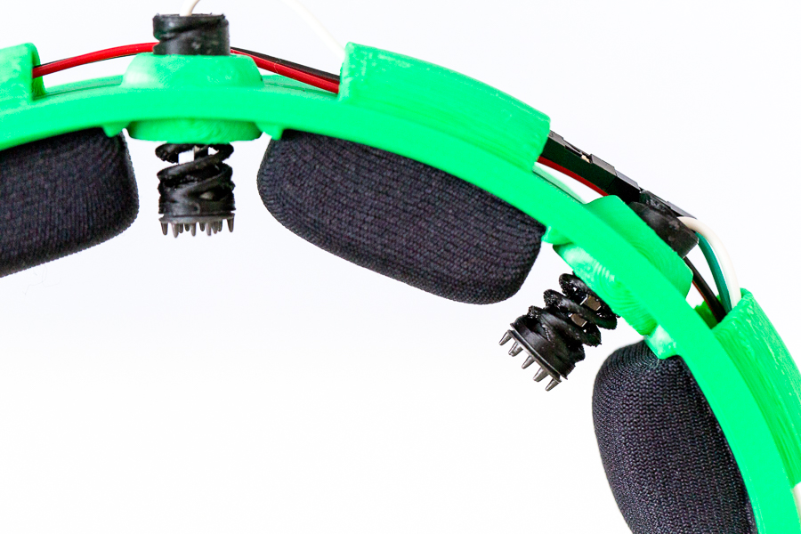

## Alternative Assemblies
Even though we have not tried this, we'd like to highlight here, that these EEG headphones can theoretically be 
easily adjusted in terms of channels and component cost. For example, you can double the number of available channels (to 16 + ref & gnd)
by attaching an <a href="https://shop.openbci.com/products/cyton-daisy-biosensing-boards-16-channel" target="_blank">OpenBCI Daisy</a> board to the Cyton board. However, this might require increasing the cable duct size to properly
stow away all the additional wires.  

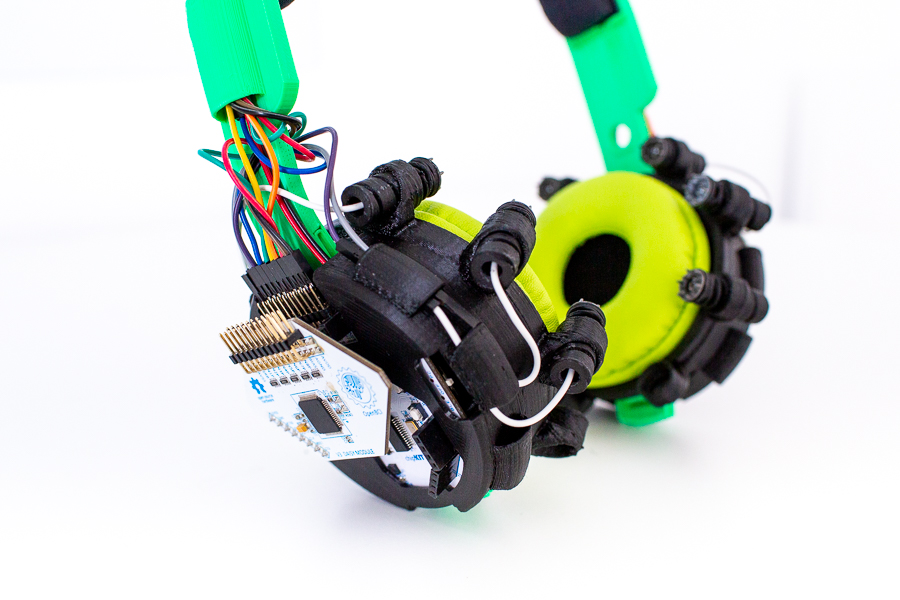

Similarly, you can reduce the number of channels (and the cost of the electronics components) by using the <a href="https://shop.openbci.com/products/bundle2" target="_blank">OpenBCI Ganglion</a> board instead (4 channels + ref & gnd).
Beware, however, that the OpenBCI Ultracortex are not typically shipped with the Ganglion board. 
Also, the left ear cover might require some adjustment of the surface cut-outs to account for the slightly different stack headers on the Ganglion board.  

------

# Use
To use the headphones for recording electrophysiological data (EEG, EMG, ECG), follow these instructions.

First, if you want to use audio (speaker and microphone), plug the audio cable into the audio jacks 
on the left and right ear and connect the other and to your PC.

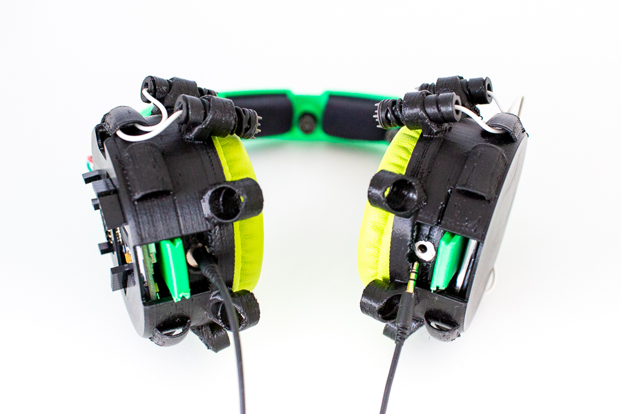

Next, turn on the power on the Cyton board. You can either push the lever up or down 
(the middle position turns the device off). The blue LED will show you that the device is powered on. 
If it doesn't power on, check that your battery is charged (see the instructions below on that).  
 
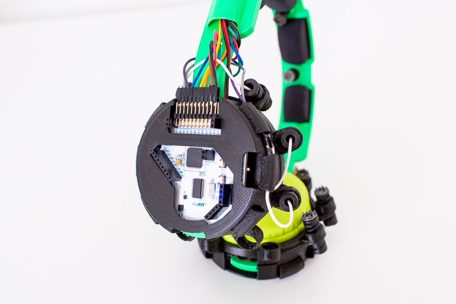

Put the headphones on your head now so that they are sitting comfortably. 
Twist the electrodes until they have firm contact with the skin (try to get some hair out of the way if you can). 
You need good skin contact for clean recordings, and that means slight pressure is required. Don't overdo it though. 
It should be sufficient to feel some contact, but it is not necessary to hurt yourself.
Also, please be patient with this initial fitting. The process will be quicker in future sessions.

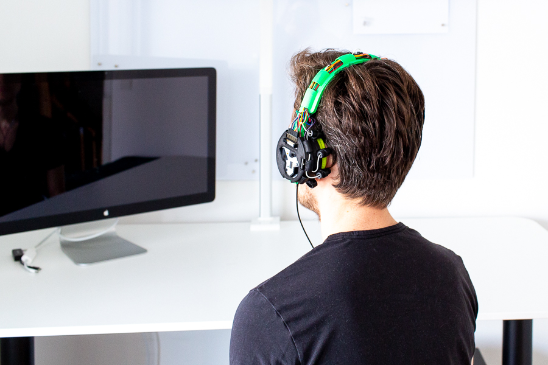
 
Finally, before starting a recording, it is important to assess good signal quality. Use the OpenBCI GUI software for this.
Plug in the USB Dongle, then start the OpenBCI GUI recording software. 
To connect to the headphones, click: "System Control Panel" > "LIVE (from Cyton)" > 
"Serial (from Dongle" > "AUTO-CONNECT"

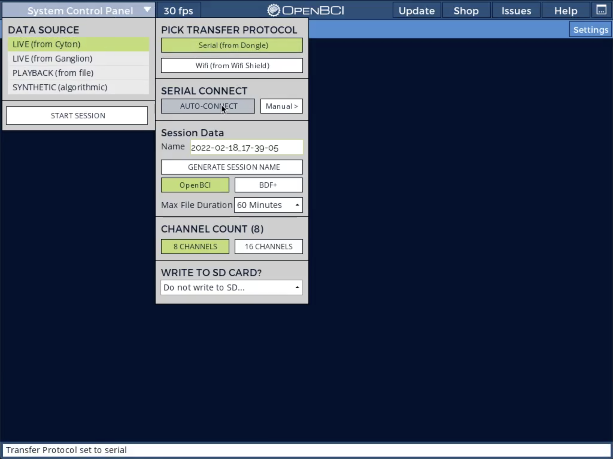

Keep the default options: 8 channel recording, no SD card recording. Then, finally, click "START SESSION".

Once you see the data coming in, set these filters (in the top view):

- 50Hz Notch (or 60Hz if you are recording in the US - 50Hz is for Europe)
- 5-50Hz Bandpass (this takes care of some low and high-frequency noise)

In the FFT widget panel (on the top right), set these parameters:

- Max Freq: 120Hz
- Max uV: 100uV
- Log/Lin: Linear
- Smooth: 0.9
- Filters?: Filtered

Now, check the amplitudes for each electrode while sitting still for a few seconds. This is very important for the recording!
You'll want to have amplitudes in the range of 5 to 30 uVrms. Also, you'll want to see
similar amplitudes for electrodes in adjacent positions. The spatial resolution of the EEG
is small. So if two electrodes next to each other show very different amplitudes, then something is going wrong. 

Also, in the PSD (top right window) you'll want to see similar curves for all the channels. 
If one channel curve is very different from the others, this typically means that something is wrong with that electrode.
There might be some hair in the way, or the electrode might just have poor contact with the skin.

If a channel seems to be recording badly, try improving the contact with the skin gently. Also, please take a 
few seconds to sit still to assess if your change caused an improvement. Sometimes, high amplitudes can also "just" mean
that the impedances will have to settle a bit. This is normal. Typically, if you set up the headset and wait a few minutes,
you'll get a much cleaner signal impression. If many channels seem to be recording badly, check the reference and ground electrodes
first. Failures in many channels typically mean that these two positions are having a problem.

Eventually, you'll want to see a recording that looks something like this:

Ok, you are set up, record away!

# Maintenance
## Charging the Battery
To charge the battery, you only need to detach the battery extension cable from the battery at the right ear. 
Gently pull out the battery cable and sever the extension cable. Be careful not to damage the extension cable by 
pulling too much on the cable itself (i.e. pull on the connector housings instead).

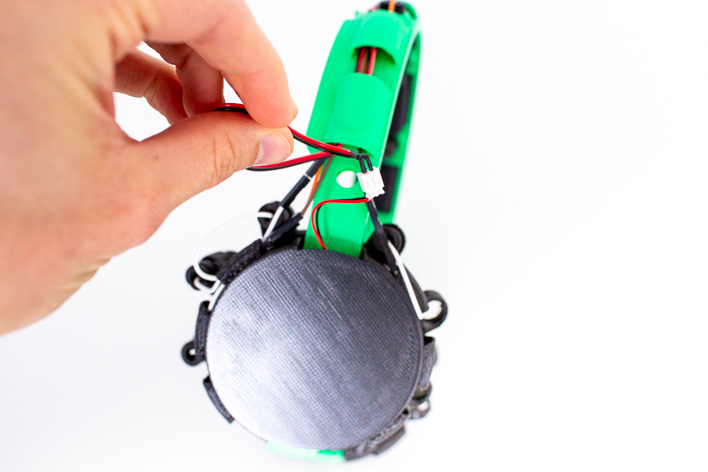

Now, connect the battery to the USB charger. The red light will light up to indicate that the battery is charging. 
Once the red light has turned off, the battery is fully charged again. The 1000mAh LiPo battery that is shown in these
instructions will last for over 12 hours on a single charge.

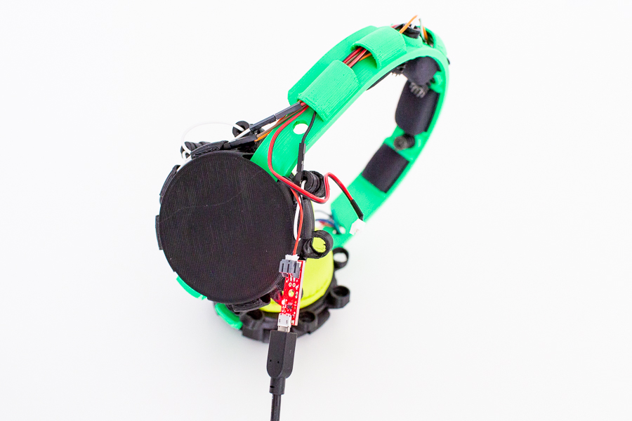   

## Changing an Electrode
To change an electrode, first, make sure to disconnect the jumper cable from the Cyton board and the electrode itself. 
At this stage, you want to make sure not to damage the electrode cable by twisting it too much while there is tension on it.

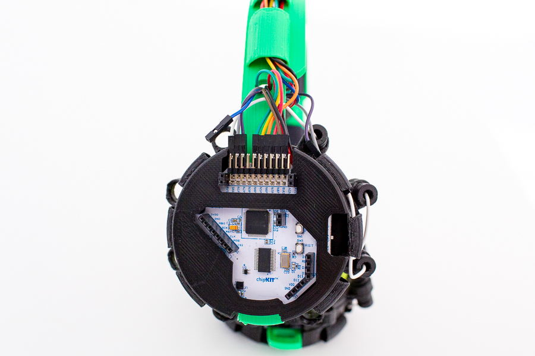

Afterwards, screw the electrode out of its slot, replace it with a new one and connect the jumper wire again. Easy-peasy!
