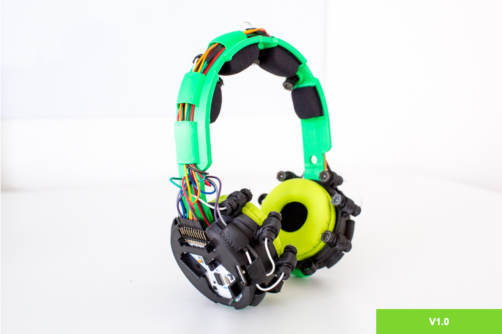
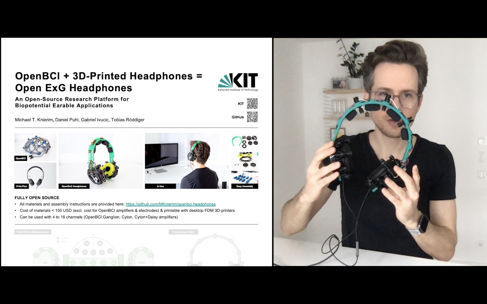

# OpenBCI Headphones

	
	

If we want our science and technology to grow faster, we need to get more people on it, right?

So, for those who also believe that Earables should be developed by more of us, this repository is for you!
It contains the description and materials for turning the OpenBCI EXG biosignal acquisition system into 
a pair of functional headphones that can also record EEG, ECG, EOG, and EMG signals.

If you have any questions or suggestions, please send a message to contact@expeeeriments.io

## Version

This is version 1.1 of these open-source EEG headphones. The major changes to V1.0 are:

- **C5 & C6 Electrode Positions** (in addition to previous electrodes)
- **Metal Spring Electrodes** (more robust and better suspension than the 3d-printed springs)
- **Re-designed Covers** (with much easier access to amplifier board and battery)
- **Solder-Free Assembly** (reduced the number of tools required for the assembly)
- **Numerous Small Improvements** (sturdier electrodes with a grip, wider headband, modular headband, ...)

## Citation

If you use the project, please cite the following article:

<cite>Michael Thomas Knierim, Daniel Puhl, Gabriel Ivucic, and Tobias Röddiger. 2023. OpenBCI + 3D-Printed Headphones = Open ExG Headphones – An Open-Source Research Platform for Biopotential Earable Applications. In Extended Abstracts of the 2023 CHI Conference on Human Factors in Comput- ing Systems (CHI EA ’23), April 23–28, 2023, Hamburg, Germany. ACM, New York, NY, USA, 7 pages. <a href="https://doi.org/10.1145/3544549.3585875" target="_blank">https://doi.org/10.1145/3544549.3585875</a></cite>

A brief video summary of this CHI submission is also uploaded on the ACMs YouTube Account:

## Resources & License
This project could not have been completed without the fantastic work by other open-source projects. 
Basically, this work is based heavily on these three projects:

1. <a href="https://docs.openbci.com/" target="_blank">OpenBCI</a> (Biosensing Components)
2. <a href="http://www.print.plus/" target="_blank">Print.Plus Headphones</a> (Headphones Design)
3. <a href="https://homebrewheadphones.com/" target="_blank">HomeBrew Headphones</a> (Audio Speakers)

All materials of those (and this project) are available under the Creative Commons Share-alike 4.0 International license.

## Related Projects

If you are interested in the Earables development space, these projects might also be interesting to you:

- <a href="https://github.com/MKnierim/openbci-ceegrids" target="_blank">OpenBCI with cEEGrids</a>
- <a href="https://open-earable.teco.edu/" target="_blank">OpenEarable</a>
- <a href="https://earables.teco.edu/" target="_blank">Earables Research from KIT</a>

# Assembly

For a summary of the materials and assembly steps head on over to the <a href="docs/Assembly.md">Assembly Instructions</a> page. The instructions show how to assemble the headphones version V1.1. The documentation for V1.0 is available in the <a href="https://github.com/MKnierim/openbci-headphones/releases/tag/v1.0">V1.0 release</a>.

# Use

After assembly, the headphones can be used just like any other OpenBCI hardware. We have summarised the <a href="docs/Recordings.md">use instructions here</a>.

