# Assembly Instructions

	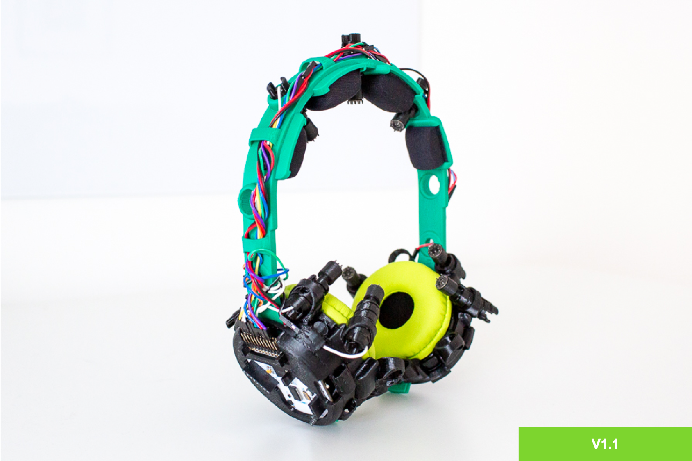
	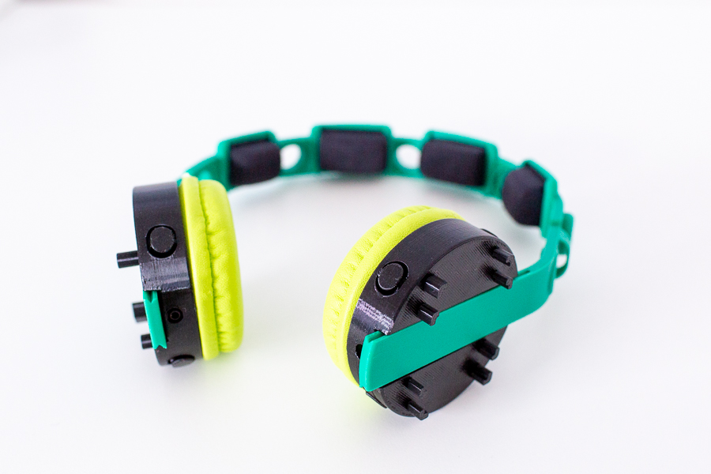
	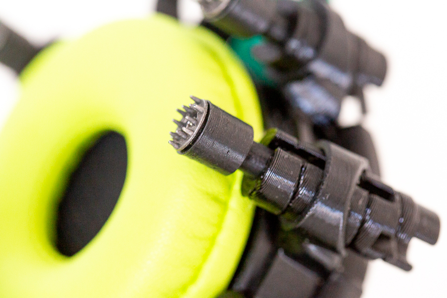
	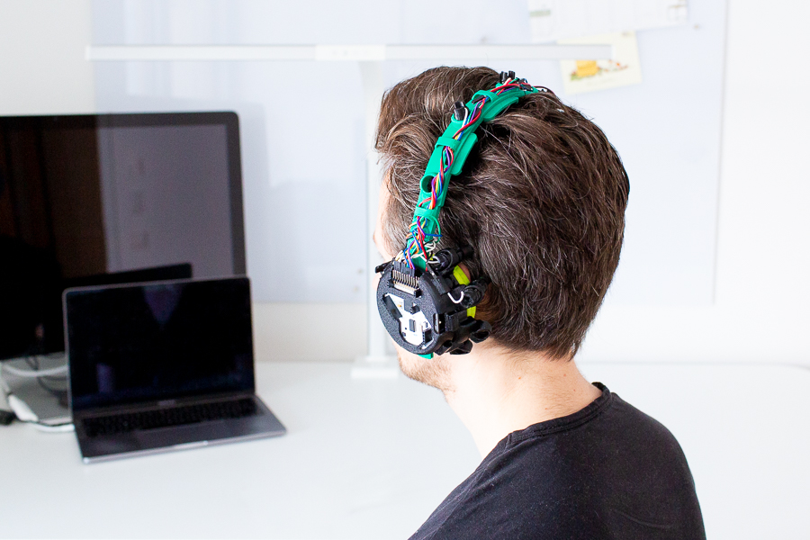

This system is designed for use with an **OpenBCI kit with the Ultracortex metal Ag/AgCl electrodes** that they want to **convert** into a headphones design. **Importantly:** You can use the headphones with all of the three available OpenBCI boards: <a href="https://shop.openbci.com/products/ganglion-board" target="_blank">Ganglion</a>, <a href="https://shop.openbci.com/products/cyton-biosensing-board-8-channel" target="_blank">Cyton</a>, or <a href="https://shop.openbci.com/products/cyton-daisy-biosensing-boards-16-channel" target="_blank">Cyton+Daisy</a>! But you will also need a set of Ultracortex electrodes to do so.

------

# List of Materials

| Amount | Part   Description                                                  | Instance /   Reference                                                                                               |
|--------|---------------------------------------------------------------------|----------------------------------------------------------------------------------------------------------------------|
| 1      | OpenBCI Board (e.g. Cyton) + Ultracortex Electrodes   (Biosignal Acquisition Kit) | Available from <a href="https://shop.openbci.com/products/d-i-y-neurotechnologists-starter-kit?variant=13043169493064" target="_blank">OpenBCI</a>   |
| 1      | 3D-Printed Headphones Kit (incl. Headband, Ear Covers, and Electrodes)  | Custom [3D-Print Files](../stl/) available in this repository. Print it yourself or get it made from <a href="https://craftcloud3d.com/" target="_blank">Craftcloud</a>.                                                        |
| 10-18  | Metal Springs (for the Electrodes - 6.5 x 10.0 mm)  | Available, e.g. at: <a href="https://www.febrotec.com/en/compression-springs/compression-springs/0x-rdf1384/" target="_blank">Febrotec</a> or <a href="https://www.amazon.de/sourcingmap-0-5mmx6mmx10mm-Edelstahl-Druckfedern-Silber/dp/B076LPPWVF/ref=sr_1_23?__mk_de_DE=%C3%85M%C3%85%C5%BD%C3%95%C3%91&crid=2D7655648IO79&keywords=Druckfedern+sourcing+map&qid=1672840610&sprefix=druckfedern+sourcing+map%2Caps%2C72&sr=8-23" target="_blank">Amazon</a>                                                        |
| 1      | Headband Cushion (kwmobile Sennheiser HD545 replacement)             | Available, e.g. at <a href="https://www.amazon.de/gp/product/B08C57V9H9/ref=ppx_yo_dt_b_asin_title_o00_s00?ie=UTF8&psc=1" target="_blank">Amazon</a>             |
| 2      | Ear Cushions (70mm diameter)                                         | Available, e.g. at <a href="https://www.amazon.de/gp/product/B089SS6WD5/ref=ppx_yo_dt_b_asin_title_o07_s01?ie=UTF8&psc=1" target="_blank">Amazon</a>              |
| 2      | Audio Drivers with JST connector          | Available, e.g. at <a href="https://paradisetronic.com/en/products/2w-8-lautsprecher-jst-anschluss" target="_blank">Paradisetronic</a>                                |
| 2      | Audio Driver Connector PCB                                                   | Custom [Speaker PCB](../pcbs/speaker-connector/) available in this repository. Get it made at <a href="https://jlcpcb.com/" target="_blank">JLCPCB</a>                               |
| 1      | Speaker Cable (Sol Republic Master Tracks HD V8 V10 V12 X3)          | Available, e.g. at <a href="http://shorturl.at/szBKM" target="_blank">Amazon</a>                                |
| 10-18     | Jumper Connector Cables Female-Male (10cm, 20cm & 40cm)              | Available, e.g. at <a href="https://www.adafruit.com/product/1953" target="_blank">Adafruit</a>                                                       |
| 1      | Lithium Ion Polymer Battery - 3.7v 500mAh or 1000mAh (JST-PH Connector)   | Available, e.g. at <a href="https://www.adafruit.com/product/1578" target="_blank">Adafruit</a> |
| 1      | Lithium Ion Polymer Battery 500mm Extension Cable (JST-PH Connector)      | Available, e.g. at <a href="https://www.adafruit.com/product/1131" target="_blank">Adafruit</a>                                           

If you do not have the time or interest for sourcing the materials, <a href="https://exgheadphones.expeeeriments.io/" target="_blank">we can also take over that step for you here</a>.

Lastly, in terms of **tools**, you will definitely need: 

- Small screwdriver (to assemble the electrodes)
- Pair of scissors (to cut the headband cushion)
- Some small pliers can be useful, but are not essential

# Assembly Instructions
To put the headphones together, you need to first make sure that you have all the required components ready. 
That means sourcing the components and, if you decide so, 3D-printing the headphone parts.
The picture below shows all components and required tools in one place.

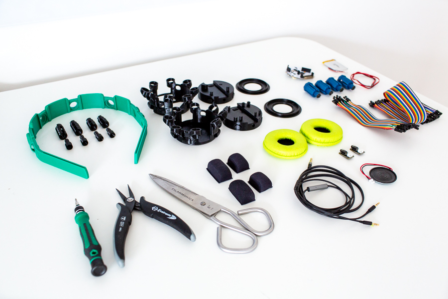
 
## 3D-Print the Parts
All of the 3D-printed parts can be manufactured using a regular desktop FDM printer with a 0.4mm brass nozzle and consumer-grade plastics (e.g. PLA).
Importantly, you don't have to set up any particular support structures. These are either not required or already modeled in.
However, some of the parts have particular requirements in terms of stiffness and strength. Therefore, we recommend selecting
appropriate materials for these parts. 

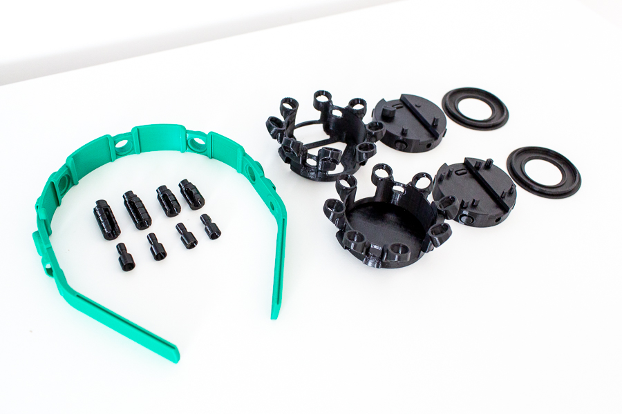

### Headband
It is of particular importance for the headband to achieve a high level of flexibility (a low level of stiffness).  
As the headband must bend sufficiently, a more elastic material prevents the headband from breaking during regular use.
Believe us, it happened more times than we'd like to admit during testing... Nevertheless, that helped us figure out suitable materials.
Previously, we used the <a href="https://www.extrudr.com/en/products/catalogue/pla-nx2-signalgrun_1980/" target="_blank">PLA NX2 from extrudr</a> 
as it provides the highest material flexibility that we found. Now we prefer using **PETG materials** as they typically have lower stiffness than PLA materials. In contrast, the <a href="https://www.extrudr.com/en/products/catalogue/green-tec-pro-schwarz_2284/" target="_blank">GreenTEC Pro from extrudr</a>, which we recommend for parts that need to be robust was found to be much too stiff for good use with the headband.

Beyond the right material, it is only important to prevent warping during the print, as already low warping levels can cause the 
electrode holes to become distorted and unusable. Therefore, we recommend printing at lower temperatures and slow speeds to allow for sufficient material cooling. 
A layer height of 0.2mm is sufficient for this part. Also, you might want to try to print with low infill to retain the flexibility (5-10%).

If your printer's build volume is too small to print the headband in one piece, there is also a modular headband version available with the .stl files.

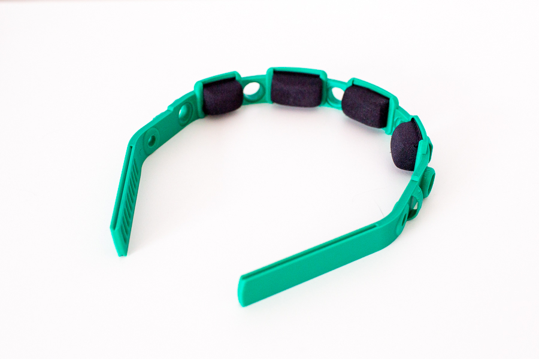

### Electrodes
As mentioned above, we recommend using a material with high stiffness like the <a href="https://www.extrudr.com/en/products/catalogue/green-tec-pro-schwarz_2284/" target="_blank">GreenTEC Pro from extrudr</a> to print the remaining parts - including the electrodes. 
This material also provides the advantage that it basically does not warp at all.

The electrodes are modular, that means that you have to print the body and head components separately - and assemble them later by adding a metal spring. There are long and short versions of the electrodes. Especially behind the ear we recommend using the longer electrode bodies.

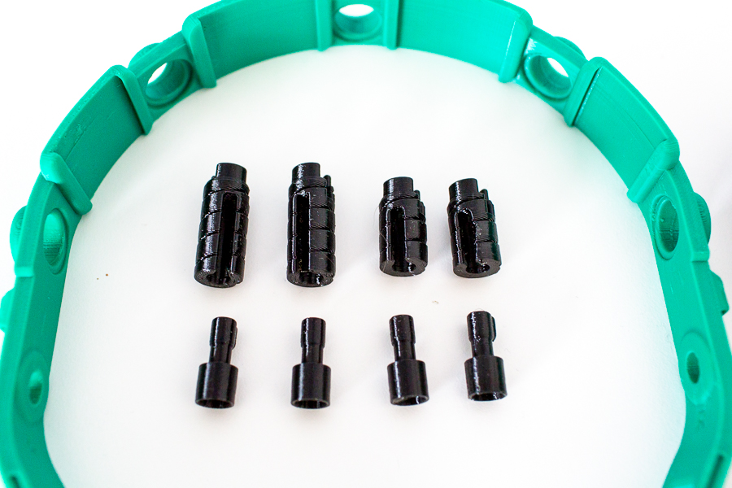
 
### Remaining Parts
The remaining parts don't have any particular requirements for printing. You can choose a material that you prefer and 
print them with a regular layer height of 0.2mm at moderate speeds (30-40 mm/s). 
In our screenshots, we used the <a href="https://www.extrudr.com/en/products/catalogue/green-tec-pro-schwarz_2284/" target="_blank">GreenTEC Pro</a> material again for these parts.
 
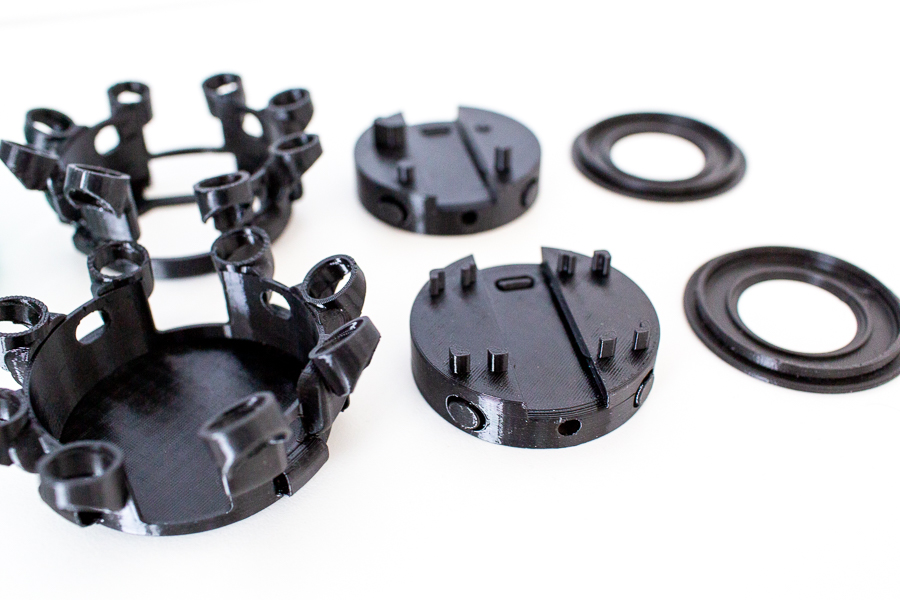

## Electrode Assembly
To finalize the electrodes, you need to convert the OpenBCI Ultracortex MK IV electrodes next.
This step is pretty straightforward. 
Use a small screwdriver to screw off the spike electrodes from their original bodies.

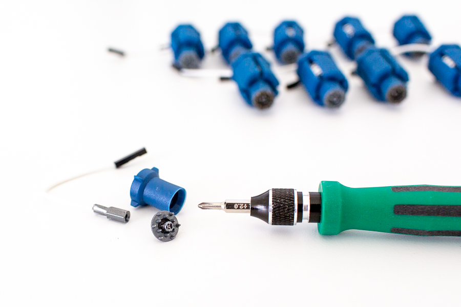
 
Afterwards, place first the terminal into the electrode head. You might have to use your screwdriver to push them in.
Be careful, though, to not damage the cable as it can fairly easily become separated if you apply too much force at the end of the crimp terminal.
Once the terminal is inserted, place the spike electrode on the top, push the electrode together slightly and tighten the screw again. 

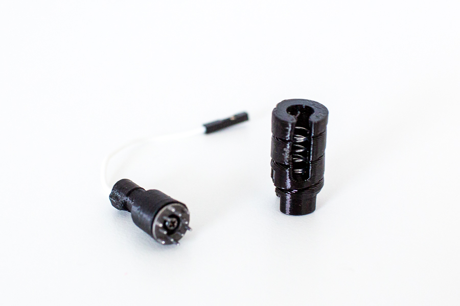

Finally, insert one of the metal springs into the electrode body and guide the jumper cable through the spring and the hole in the bottom of the electrode body. Then push the electrode head into the electrode body.

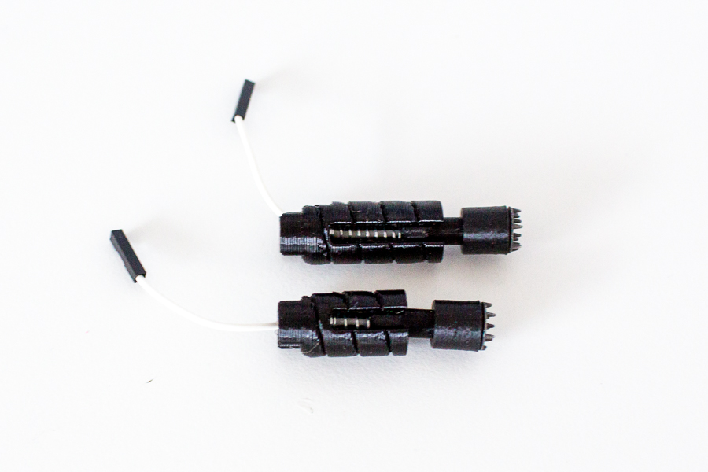

Do this a couple of times, and voilà - you have a nice set of headphone electrodes. You can afterwards decide which jumper cable length you need for a particular electrode position.

## Cushion Assembly
Next, you can ready the headband and speaker covers by attaching the cushions. 
Having these cushions is super important to achieve decent wearing comfort.
To complete this step, you will require only a pair of scissors.

The headband cushion piece can be cut off at the bridges between the pads.

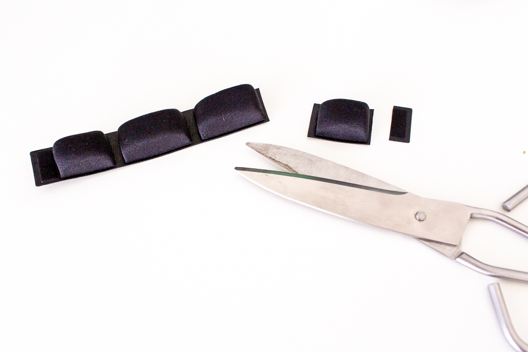

Once you have done this, you can start inserting the individual pads into the headband. 
It might take a few tries to cut them to the correct size. 
Leave a slight overhang at each pad to make sure the pad is kept in place by some pressure. 

For the speaker cover, stretch the fabric a bit over the cover to attach the cushion.
Piece of cake. It can take some fabric wrestling, though, on the first try.

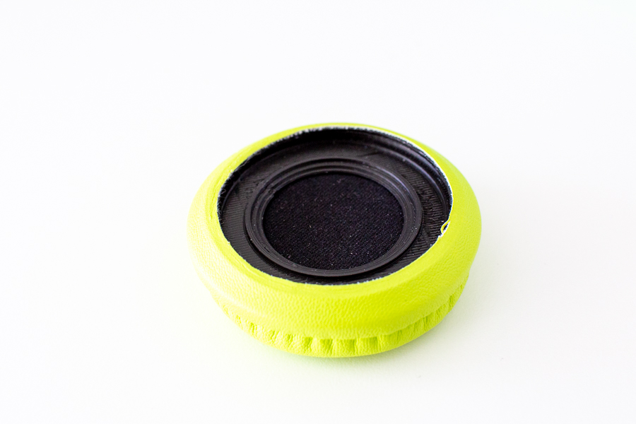

## Speaker Assembly
For the assembly of the speaker, you need the connector PCB and the speaker with JST connector. These two components make the assembly super quick and easy.

First, attach the Speaker JST cable to the PCB and place the PCB face down into the 3D-printed holder. 
Then, you can place the speaker in the housing (see picture below). Be careful not to damage the fragile mylar film in the drivers.

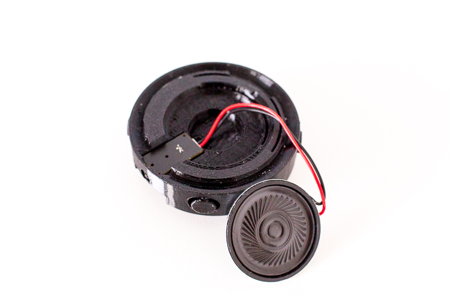

Finally, to complete the speaker assembly, place the speaker cover with the ear cushions on top and twist to lock them in place. Ta daaaa - you have got some real headphone speakers - assembled all by yourself!

If you would like to tune the sound, please take a look at the <a href="https://homebrewheadphones.com/build/" target="_blank">HomeBrew Headphones build instructions</a> where a thorough documentation is provided for this step.

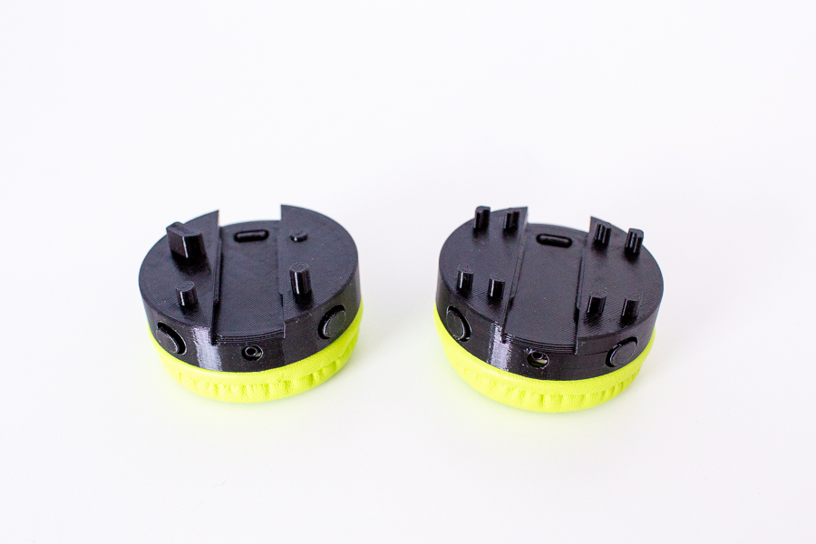

## Electronics Assembly
After all components are ready, you can now finally put the headset together. 
To do this, first, place the Cyton board into the outer enclosure and the battery on the inner enclosure.
For the Cyton board, attach the battery extension cable already.

	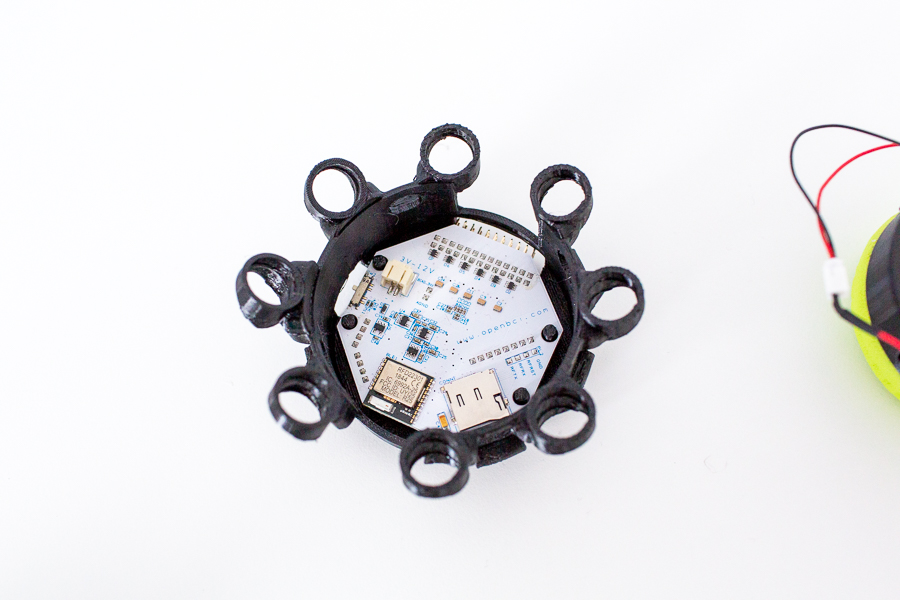
	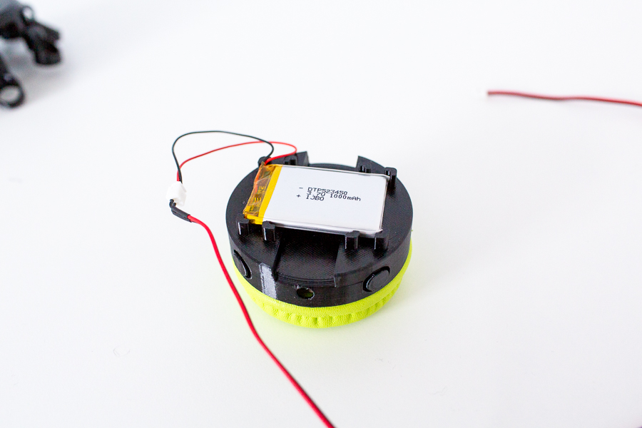

Now, place the covers over the speaker housings.

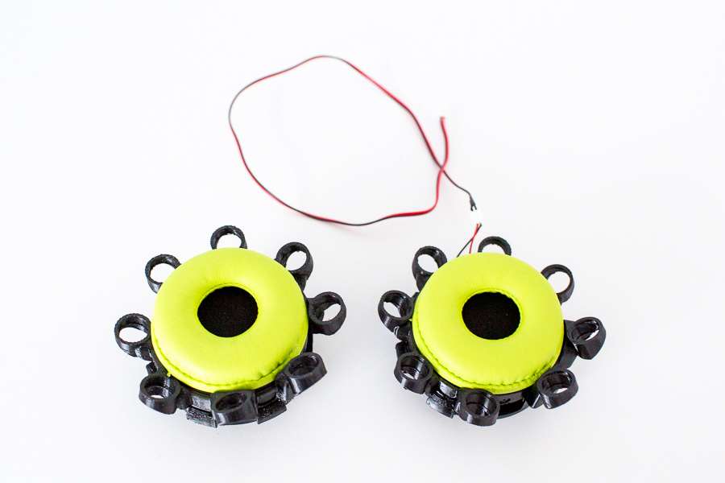

Next, attach the headband to both the left and right speakers. After this, you can route the battery cable from 
the left to the right ear. Test if the Cyton board can be powered on before continuing.

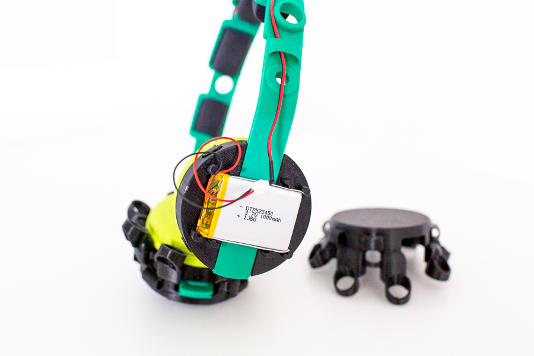

At this stage, things are starting to look like headphones, right? Now the only thing left to do is to attach the
electrodes. No electrodes - no ExG signals. The electrodes screw in the holders easily. Before you start
screwing around, you should take a second though, to consider which electrode positions you would like to use in your recordings.

As the headphones feature a total of 21 electrode positions, you cannot record directly from all positions with the OpenBCI amplifiers (Ganglion: 4 + REF&GND, Cyton: 8 + REF&GND, Cyton+Daisy: 16 + REF&GND). Thus, you need to decide which electrode positions to use. Your selection for the electrode positions should allow measuring the phenomenon you are interested in. The following schematic provides an overview of the available channels (rooted in the international 10-20 system for the positions on the top of the head and the cEEGrid nomenclature for the around-the-ear positions).

	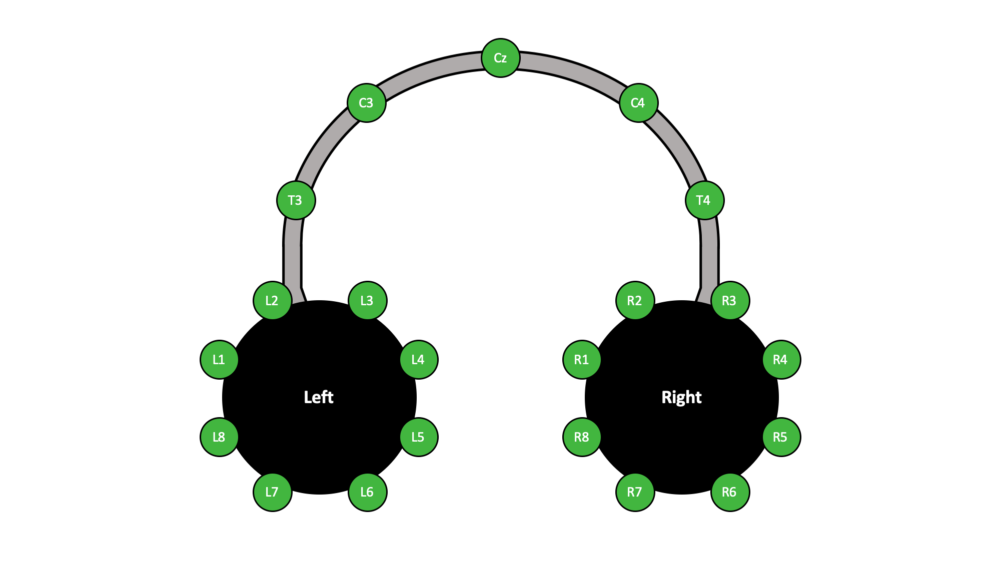
	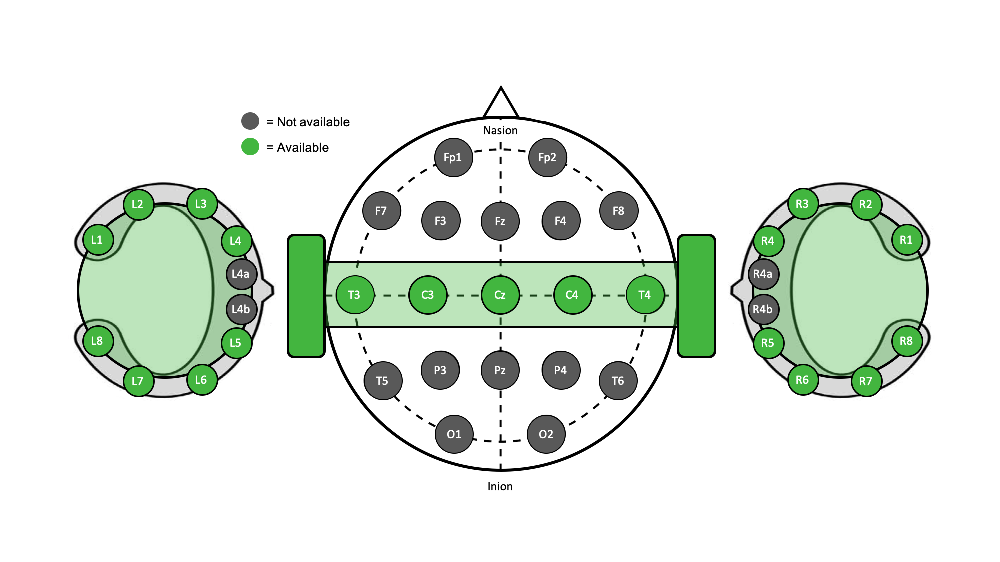

<b>*Hint 1:*</b> We provide these <a href="../positions/headphone_electrode_positions_diagrams.pptx" target="_blank">schematics as a .PPTX file</a> with the repository. You are free to use it for publication or similar purposes.

<b>*Hint 2:*</b> For analyses later on we also provide <a href="../positions/">electrode position coordinates files</a> with the repository. You can use these with <a href="https://mne.tools/stable/auto_tutorials/intro/40_sensor_locations.html" target="_blank">MNE Python</a> or <a href="https://eeglab.org/tutorials/04_Import/Channel_Locations.html" target="_blank">EEGLab</a>.

Once you have decided, screw the electrodes into their holders and attach the jumper wires. 
Route the wires through the cable ducts and onto the Cyton board (in the bottom row!). Make sure to attach the cables snugly (possibly wrapping it around the headband to improve the fit).

We recommend using the same color scheme as in OpenBCI GUI for the different channels (see screenshot below).
This will help immensely later on if you have trouble achieving good contact at a specific electrode position.

For the OpenBCI boards, the reference electrode needs to be attached to the first pin (SRB2 pin), the ground electrode 
needs to be attached to the penultimate pin (BIAS pin). For more details on how to set up the Cyton to record EEG, 
please take a look at the <a href="https://docs.openbci.com/GettingStarted/Boards/CytonGS/" target="_blank">excellent documentation from OpenBCI</a>.  

Well, that is really it. You are set up and ready to go! This is what your resulting headset should look like during this final setup step:

	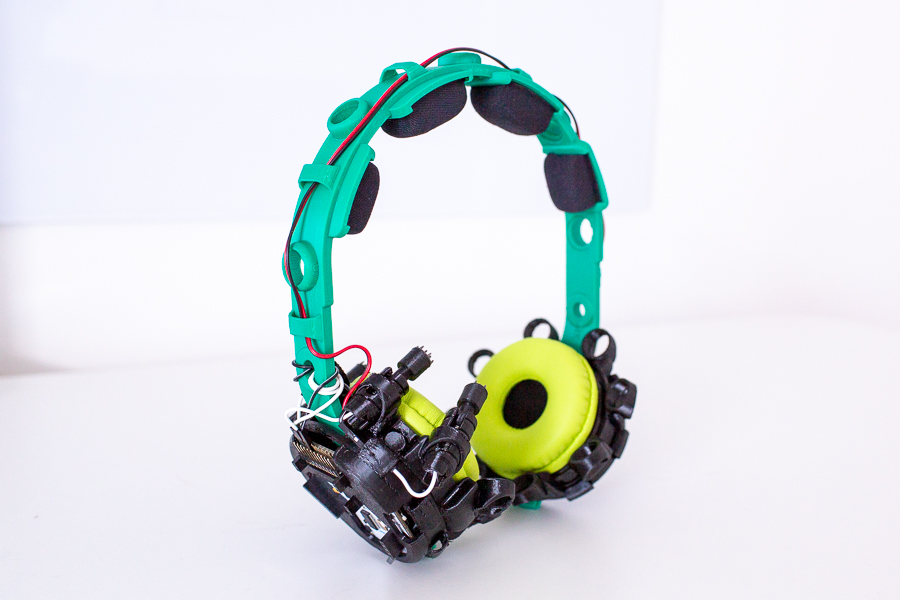
	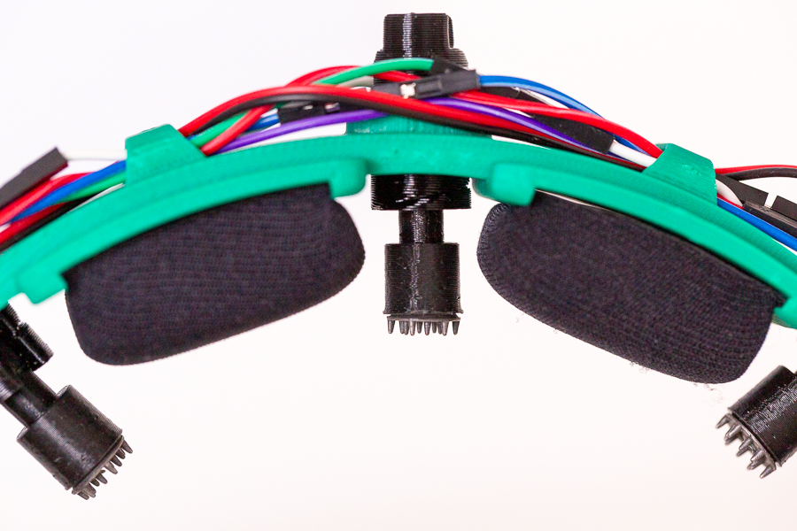
	

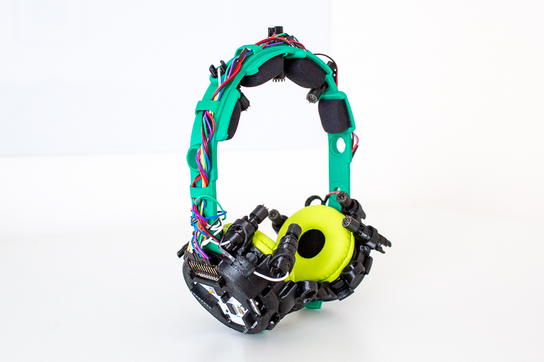

# Use

After assembly, the headphones can be used just like any other OpenBCI hardware. We have summarised the <a href="Recordings.md">use instructions here</a>.

# Maintenance

For information on how to charge the battery or change an electrode, please head over to the <a href="Maintenance.md">maintenance instructions here</a>.
