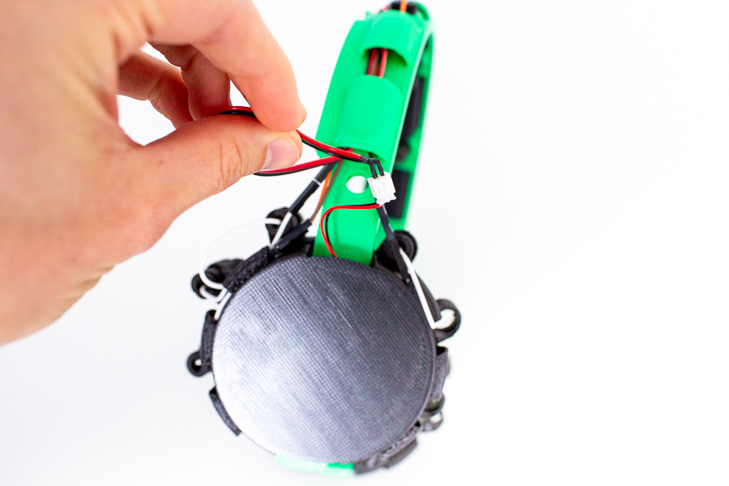
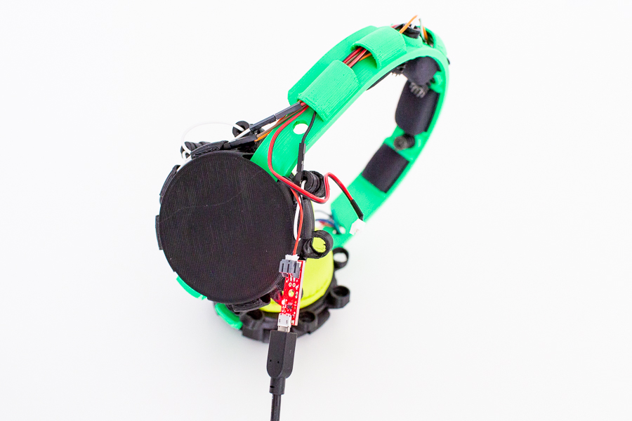
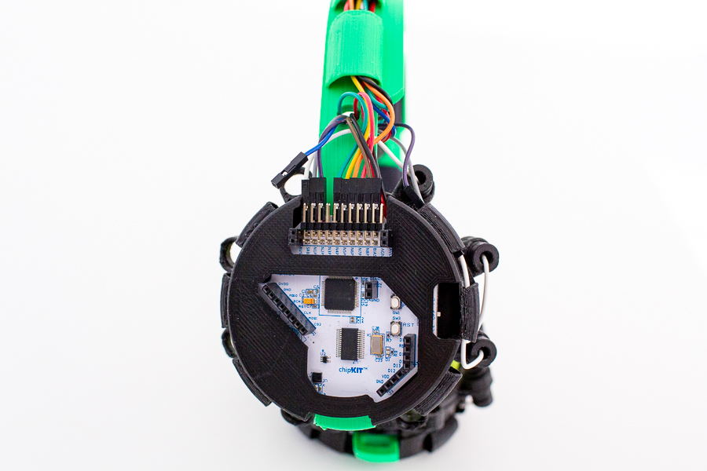

# Maintenance
## Charging the Battery
To charge the battery, you only need to detach the battery extension cable from the battery at the right ear. 
Gently pull out the battery cable and sever the extension cable. Be careful not to damage the extension cable by 
pulling too much on the cable itself (i.e. pull on the connector housings instead).

Now, connect the battery to the USB charger. The red light will light up to indicate that the battery is charging. 
Once the red light has turned off, the battery is fully charged again. The 1000mAh LiPo battery that is shown in these
instructions will last for over 12 hours on a single charge.

## Changing an Electrode
To change an electrode, first, make sure to disconnect the jumper cable from the Cyton board and the electrode itself. 
At this stage, you want to make sure not to damage the electrode cable by twisting it too much while there is tension on it.

Afterwards, screw the electrode out of its slot, replace it with a new one and connect the jumper wire again. Easy-peasy!
