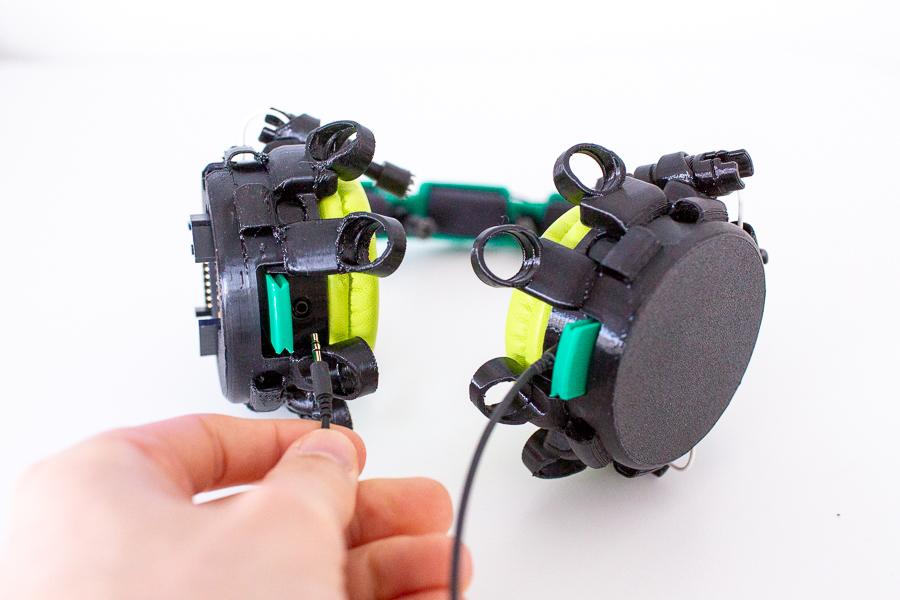
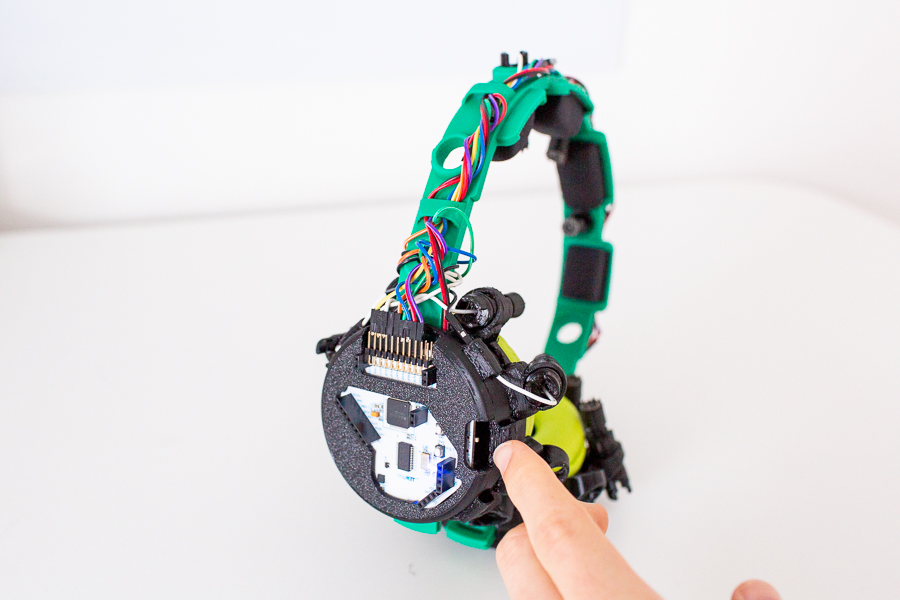
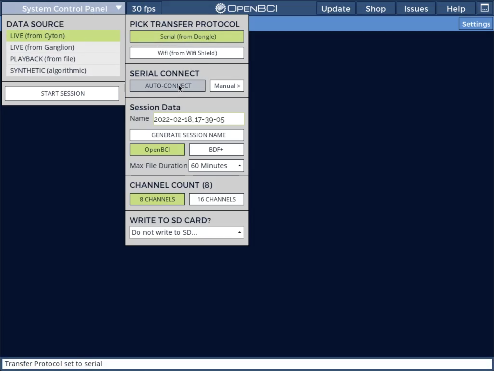

# Recording Instructions
To use the headphones for recording electrophysiological data (EEG, EMG, ECG), follow these instructions.

First, if you want to use audio (speaker and microphone), plug the audio cable into the audio jacks 
on the left and right ear and connect the other and to your PC.

Next, turn on the power on the Cyton board. You can either push the lever up or down 
(the middle position turns the device off). The blue LED will show you that the device is powered on. 
If it doesn't power on, check that your battery is charged (see the instructions below on that).  
 
 

Put the headphones on your head now so that they are sitting comfortably. 
Twist the electrodes until they have firm contact with the skin (try to get some hair out of the way if you can). 
You need good skin contact for clean recordings, and that means slight pressure is required. Don't overdo it though. 
It should be sufficient to feel some contact, but it is not necessary to hurt yourself.
Also, please be patient with this initial fitting. The process will be quicker in future sessions.

 
Finally, before starting a recording, it is important to assess good signal quality. Use the OpenBCI GUI software for this.
Plug in the USB Dongle, then start the OpenBCI GUI recording software. 
To connect to the headphones, click: "System Control Panel" > "LIVE (from Cyton)" > 
"Serial (from Dongle" > "AUTO-CONNECT"

Keep the default options: 8 channel recording, no SD card recording. Then, finally, click "START SESSION".

Once you see the data coming in, set these filters (in the top view):

- 50Hz Notch (or 60Hz if you are recording in the US - 50Hz is for Europe)
- 5-50Hz Bandpass (this takes care of some low and high-frequency noise)

In the FFT widget panel (on the top right), set these parameters:

- Max Freq: 120Hz
- Max uV: 100uV
- Log/Lin: Linear
- Smooth: 0.9
- Filters?: Filtered

Now, check the amplitudes for each electrode while sitting still for a few seconds. This is very important for the recording!
You'll want to have amplitudes in the range of 5 to 30 uVrms. Also, you'll want to see
similar amplitudes for electrodes in adjacent positions. The spatial resolution of the EEG
is small. So if two electrodes next to each other show very different amplitudes, then something is going wrong. 

Also, in the PSD (top right window) you'll want to see similar curves for all the channels. 
If one channel curve is very different from the others, this typically means that something is wrong with that electrode.
There might be some hair in the way, or the electrode might just have poor contact with the skin.

If a channel seems to be recording badly, try improving the contact with the skin gently. Also, please take a 
few seconds to sit still to assess if your change caused an improvement. Sometimes, high amplitudes can also "just" mean
that the impedances will have to settle a bit. This is normal. Typically, if you set up the headset and wait a few minutes,
you'll get a much cleaner signal impression. If many channels seem to be recording badly, check the reference and ground electrodes
first. Failures in many channels typically mean that these two positions are having a problem.

Eventually, you'll want to see a recording that looks something like this:

Ok, you are set up, record away!
